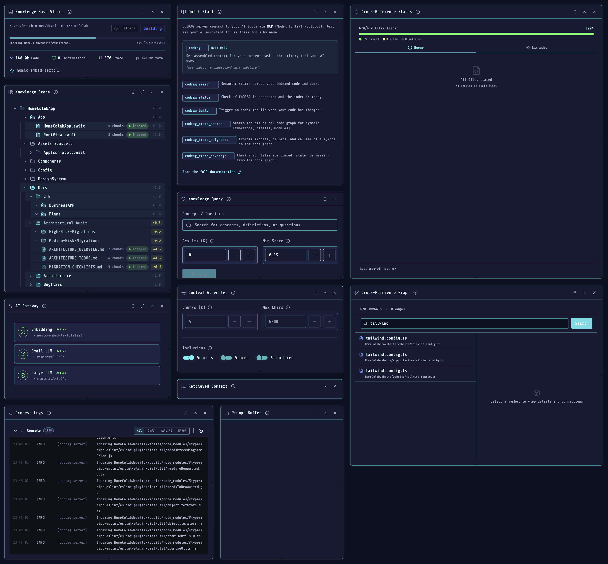
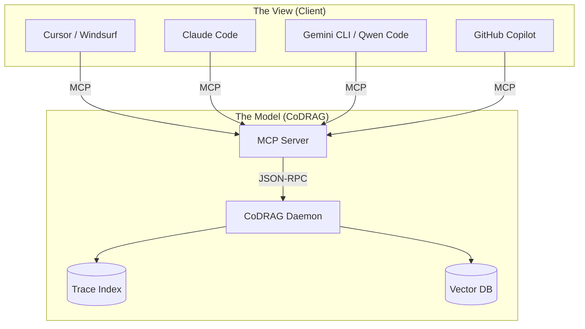

<p align="center">
  
</p>

<h2 align="center"><em>The bridge between how you think about code and how AI reads it.</em></h2>

<div align="center">

[](LICENSE)
[](https://modelcontextprotocol.io)
[](https://codrag.io)

</div>

**Code Documentation and RAG** — Local-first codebase intelligence for developers and AI coding agents.

AI assistants are only as good as the context they receive. Most tools send fragments — a single file, a keyword match — and the model fills in the gaps with hallucinations. CoDRAG fixes this by building a **persistent, semantic index** of your entire codebase (or multiple repos) and serving bounded, source-cited context on demand.

> **Important:** CoDRAG is a **local desktop application**, not a cloud service. This repository contains the MCP server shim — a thin wrapper that connects your AI tools to the CoDRAG engine running on your machine. **You must install the full CoDRAG application first.** See [Installation](#installation) below.

### Core capabilities

- **Semantic search** — find code by intent, not just keywords. Results are ranked by relevance across every file in the project.
- **Trace Index** — a structural code graph (symbols, imports, call chains) so agents can reason about *how* code connects, not just *where* it lives.
- **Context assembly** — returns bounded, LLM-ready chunks with source attribution. No more "which file was that from?"
- **MCP for AI tools** — plug into Cursor, Windsurf, Claude Code, VS Code, Gemini CLI, Qwen Code, GitHub Copilot, or JetBrains via Model Context Protocol. The agent gets the same index you do.
- **Local-first** — your code never leaves your machine. Indexes are built and queried locally; nothing is uploaded.

---



## Why CoDRAG?

AI tools are evolving fast. The context they need shouldn't be locked inside one specific editor.

| Developer Problem | CoDRAG Solution |
|:---|:---|
| **"AI hallucinations"** | AI guesses when it lacks context or gets condused with too much context. CoDRAG provides **grounded, guided, source-cited context** from targeted parts of your codebase. |
| **"Fragmented Context"** | Each tool (Cursor, VS Code, CLI) has its own partial index. CoDRAG is a **unified context server** for *all* your tools. |
| **"Dumb Search"** | grep/regex misses concepts. CoDRAG uses **Trace Indexing** (Who calls this? What implements this interface?) + Semantic Search. |
| **"Privacy Risks"** | Most tools upload code to index it. CoDRAG is **100% Local-First**. Your code never leaves your machine. |
| **"Context Window Limits"** | Pasting huge files wastes tokens. CoDRAG uses **Structural Compression** (LOD) to pack 3–20× more files into the same window — no GPU or sidecar needed. |
| **"Managing separate RAG indexes for 5+ repos is tedious"** | Single daemon manages all projects. |
| **"Each IDE tool spins up its own Ollama connection"** | Shared LLM connection pool. |
| **"Juggling multiple ports/processes per project"** | One port (8400), project tabs in UI. |
| **"Finding relevant code takes 20+ minutes for new devs"** | Pre-indexed codebase with instant semantic search. |
| **"AI assistants forget codebase context between sessions"** | Persistent trace index + structural memory. |

---

## Installation

CoDRAG is a desktop application. Install it first, then configure your AI tools to connect via MCP.

### Prerequisites
- macOS 11+ or Windows 10+
- 4GB free disk space
- Ollama (optional, for embeddings — CoDRAG also ships native ONNX embeddings)

### Step 1: Install the CoDRAG Application

```bash
# macOS (Homebrew)
brew install --cask codrag

# Windows (winget)
winget install MagneticAnomaly.CoDRAG
```

Or download directly from [codrag.io/download](https://codrag.io/download).

*The core engine is free for personal use (1 active project). See [codrag.io/pricing](https://codrag.io/pricing) for Pro/Team tiers.*

### Step 2: Start the Daemon and Index a Project

```bash
# Start the daemon
codrag serve

# Register a repo
codrag add /path/to/your/repo

# Build the index (async)
codrag build

# Open the dashboard (optional)
codrag ui
```

### Step 3: Connect Your AI Tool via MCP

Once CoDRAG is running, connect any MCP-compatible tool:

```bash
# Start MCP in server mode (connects to the running daemon)
codrag mcp --auto

# Generate IDE config (prints JSON you can paste into your tool's settings)
codrag mcp-config --ide cursor
codrag mcp-config --ide claude
codrag mcp-config --ide all
```

### With Ollama (optional)

```bash
# Install Ollama (if not installed)
curl -fsSL https://ollama.com/install.sh | sh

# Pull the recommended embedding model
ollama pull nomic-embed-text        # standard quality (~274 MB)

# CoDRAG will auto-detect Ollama at localhost:11434
# No Ollama? Run: codrag models  (downloads v1.5 ONNX backup, ~132 MB)
```

---

## Multi-Project Setup

CoDRAG supports multiple projects in a single daemon. When you invoke `codrag` from an AI tool like Windsurf or Cursor, the MCP server needs to know **which project** to query. There are three routing mechanisms, applied in priority order:

### 1. Auto-Detect from Workspace (Default)

When your IDE opens a workspace, it spawns a separate MCP process per window. CoDRAG matches the workspace root against registered project paths:

```
Windsurf Window 1: /Users/you/projects/frontend
  → MCP auto-detects → CoDRAG project "frontend"

Windsurf Window 2: /Users/you/projects/backend
  → MCP auto-detects → CoDRAG project "backend"
```

This works automatically with:
- **Per-workspace config** (`.windsurf/mcp.json` or `.cursor/mcp.json` in each project root)
- **Global config** — the IDE sets the MCP subprocess CWD to the workspace root

Detection sources (checked in order):
1. **MCP initialize roots** — workspace URIs sent by the IDE during handshake
2. **Process CWD** — the working directory of the MCP subprocess
3. **Single-project shortcut** — if only one project exists, it's used automatically

### 2. Pinned Project (CLI Flag)

Pin the MCP to a specific project by ID. Useful for global configs when auto-detect isn't sufficient:

```bash
# Generate config pinned to a specific project
codrag mcp-config --ide windsurf --project proj_abc123

# Resulting config:
# { "command": "codrag", "args": ["mcp", "--project", "proj_abc123", "--daemon", "http://127.0.0.1:8400"] }
```

### 3. Tool-Level Override (AI Self-Correction)

Every CoDRAG tool accepts an optional `project_id` parameter. If auto-detect is ambiguous, the AI model receives the full project list in the error message and can retry with an explicit ID:

```json
// AI calls codrag_status, gets ambiguous error with project list
// AI retries with explicit project_id:
{ "name": "codrag", "arguments": { "query": "auth flow", "project_id": "proj_abc123" } }
```

The `codrag_status` tool also returns `available_projects` when multiple projects exist, so the AI can discover project IDs proactively.

### Recommended Setup for Multiple Projects

**Option A: Per-project config (recommended for Windsurf/Cursor)**

Place a `.windsurf/mcp.json` (or `.cursor/mcp.json`) in each project root:

```json
{
  "mcpServers": {
    "codrag": {
      "command": "codrag",
      "args": ["mcp", "--daemon", "http://127.0.0.1:8400"]
    }
  }
}
```

Each window gets its own MCP process with auto-detection.

**Option B: Global config with auto-detect**

Single config, auto-detection handles routing:

```bash
codrag mcp-config --ide windsurf --mode auto
```

**Option C: Global config with pinned project**

For single-project users or dedicated tool windows:

```bash
codrag mcp-config --ide windsurf --project proj_abc123
```

---

## Verified Integrations

CoDRAG works with any MCP-compatible client. We officially verify and document the following:

### Tier 1: Verified
- **[Cursor](https://cursor.sh)** — The AI code editor.
- **[Windsurf](https://windsurf.ai)** — The agentic IDE.
- **[Claude Code](https://docs.anthropic.com/en/docs/claude-code)** — Anthropic's terminal-native coding agent.
- **[VS Code](https://code.visualstudio.com)** — Via the official CoDRAG extension or MCP plugin.
- **[GitHub Copilot](https://github.com/features/copilot)** — Via MCP integration in VS Code / JetBrains.
- **[Gemini CLI](https://github.com/google-gemini/gemini-cli)** — Google's terminal agent for Gemini models.
- **[Qwen Code](https://github.com/QwenLM/qwen-code)** — The terminal agent for Qwen models.

### Tier 2: Community
- **[Gemini CLI Desktop](https://github.com/Piebald-AI/gemini-cli-desktop)** — GUI frontend for Gemini CLI / Qwen Code with MCP support.
- **JetBrains** — Supported via generic MCP plugins.
- **Zed** — Experimental support.

---

## The "Context MVC" Architecture

We believe in a **Model-View-Controller** approach to AI development:

- **The Model (CoDRAG)**: The source of truth. Manages the trace graph, file index, semantic search, and context assembly.
- **The View (Your Tool)**: Cursor, Windsurf, Claude Code, Gemini CLI, Qwen Code, or VS Code. Handles the UI and LLM inference.

CoDRAG is the universal model. Bring your own view.

---

## Vision

CoDRAG is a **local-first, team-ready** application that provides:

- **Semantic code search** across multiple codebases simultaneously
- **Trace indexing** for structural understanding (symbols, imports, call graphs)
- **LLM augmentation** for intelligent summaries and context assembly
- **Unified dashboard** with project tabs, search, and visualization
- **MCP integration** for AI tools (Cursor, Windsurf, Claude Code, Gemini CLI, Qwen Code, VS Code, Copilot)

---

## Architecture Overview

```
┌─────────────────────────────────────────────────────────────────────────┐
│                              CoDRAG                                     │
├─────────────────────────────────────────────────────────────────────────┤
│  Dashboard (React/Vite → Tauri for MVP)                                 │
│  ├── Project Tabs (LinuxBrain, HalleyApp, Website, ...)                 │
│  ├── Search / Context / Trace views                                     │
│  └── Settings / LLM Status                                              │
├─────────────────────────────────────────────────────────────────────────┤   
│  HTTP API (FastAPI @ :8400)                                             │
│  ├── /projects/*           Project management                           │
│  ├── /projects/{id}/build  Index building                               │
│  ├── /projects/{id}/search Semantic search                              │
│  ├── /projects/{id}/trace  Structural queries                           │
│  └── /llm/*                LLM service status                           │
├─────────────────────────────────────────────────────────────────────────┤
│  Core Engine                                                            │
│  ├── ProjectRegistry       SQLite-backed project config                 │
│  ├── EmbeddingIndex        Semantic vector search (per project)         │
│  ├── TraceIndex            Symbol graph + import edges                  │
│  ├── FileWatcher           Auto-rebuild on changes                      │
│  └── LLMCoordinator        Ollama connection management                  │
├─────────────────────────────────────────────────────────────────────────┤
│  CLI                                                                    │
│  codrag serve | add | build | search | ui | mcp                         │
└─────────────────────────────────────────────────────────────────────────┘
            │                                        │
            ▼                                        ▼
       ┌─────────┐                              ┌─────────┐
       │ Ollama  │                              │ Project │
       │ :11434  │                              │  Dirs   │
       └─────────┘                              └─────────┘
```



---

## Key Features

### Multi-Project Management
- Add multiple local codebases to single daemon
- Each project maintains isolated index data
- Switch between projects via tabs or CLI
- Cross-project search (enterprise tier only)

### Hybrid Index Mode
- **Standalone mode** (default): Index stored in `~/.local/share/codrag/projects/`
- **Embedded mode** (team): Index stored in project `.codrag/` directory
- Teams can commit embedded indexes to git to skip initial indexing time

### Trace Index
Beyond keyword/semantic search, CoDRAG builds a **structural graph**:
- **Nodes:** Files, symbols, classes, functions, endpoints
- **Edges:** Imports, calls, inheritance relationships
- Queries: Find all callers of a function, trace import chains, explore class hierarchies

### Graph Enrichment (Multi-Pass Pipeline)
The structural graph is just the skeleton. A multi-pass enrichment pipeline layers deeper understanding on top:
- **Structural Graph** (Rust, ~100ms) — tree-sitter for code, Markdown scanner for docs
- **Fast Catalogue** (3b LLM) — per-file summaries, role classification, relationship hypotheses
- **Relationship Validation** (Rust) — LLM hypothesizes, Rust validates against the graph. Hallucinations discarded.
- **Epistemic Enrichment** (14b LLM) — domain tags, architecture layers, design patterns, doc↔code cross-references
- **Cluster Synthesis** (14b LLM) — subsystem-level module summaries with entry points and data flow
- **Continuous Deepening** — self-refining loop that converges when all epistemic scores ≥ 0.95

Each node gets an **epistemic score** (0.0–1.0) measuring how well the graph understands it — and scores decay on change, so the graph stays current as your codebase evolves.

### LLM Integration
- **Embeddings:** Ollama (`nomic-embed-text-v2-moe` recommended) or native ONNX v1.5 as a zero-dependency fallback
- **Compression:** Built-in LOD (structural code compression, 3–20×, no model needed)
- **Augmentation:** Mistral/Llama (optional) for code summaries
- Reuses single Ollama connection across all indexed projects

### AGENTS.md Generation
Generate [AGENTS.md](https://agents.md/) documentation from trace index:
- Project structure with file counts and organization
- Detected entry points and key modules
- Discovered build/test commands from common files
- API endpoints extracted from route definitions

---

## CLI Reference

The CLI is implemented with Typer; run `codrag --help` or `codrag <command> --help` for detailed help.

### Common examples

```bash
# Start the daemon
codrag serve

# Add a repo
codrag add /path/to/your/repo

# Build the index (async)
codrag build

# Search your codebase
codrag search "authentication middleware"

# Assemble context for an LLM
codrag context "explain the login flow" --raw

# IDE integration (MCP)
codrag mcp --auto
```

### Full options (reference)

```bash
# Tip: most daemon-backed commands accept --host/--port (default: 127.0.0.1:8400)

# Daemon
codrag serve [--host 127.0.0.1] [--port 8400] [--reload]              # Start the daemon

# Projects
codrag add <path> [--name "Name"] [--mode standalone|embedded] \
  [--host 127.0.0.1] [--port 8400]                                     # Register project
codrag list [--host 127.0.0.1] [--port 8400]                            # List projects
codrag remove <project-id> [--purge] [--host 127.0.0.1] [--port 8400]   # Unregister project

# Index lifecycle
codrag status [project-id] [--host 127.0.0.1] [--port 8400]             # Index status
codrag build [project-id] [--full] [--host 127.0.0.1] [--port 8400]     # Trigger build (async)

# Retrieval
codrag search "query" [--project <project-id>] [--limit 10] [--min-score 0.15] \
  [--host 127.0.0.1] [--port 8400]                                      # Semantic search
codrag context "query" [--project <project-id>] [--limit 5] [--max-chars 8000] [--raw] \
  [--host 127.0.0.1] [--port 8400]                                      # Assemble context

# UI
codrag ui [--port 8400]                                                 # Open dashboard

# MCP (IDE integration)
codrag mcp [--mode server|direct] [--daemon http://127.0.0.1:8400] \
  [--auto] [--project <project-id>] [--repo-root <path>]                # Run MCP server (stdio)
codrag mcp-config [--ide claude|cursor|windsurf|vscode|jetbrains|all] \
  [--mode auto|project|direct] [--daemon http://127.0.0.1:8400] [--project <project-id>]  # Print IDE config JSON

# Extras
codrag activity [--weeks 12] [--no-legend] [--no-labels] [--json] \
  [--host 127.0.0.1] [--port 8400]                                      # Activity heatmap
codrag coverage [--project <id>] [--host 127.0.0.1] [--port 8400]       # Coverage visualization
codrag overview [--weeks 12] [--host 127.0.0.1] [--port 8400]            # Terminal overview dashboard
codrag drift [--project <id>] [--host 127.0.0.1] [--port 8400]          # Index drift report
codrag flow [--project <id>] [--host 127.0.0.1] [--port 8400]           # RAG flow visualization
codrag config [key] [value] [--host 127.0.0.1] [--port 8400]            # View/modify config
codrag version                                                          # Version
```

---

## Configuration

### Global Config

```yaml
# ~/.config/codrag/config.yaml

# LLM Services
ollama:
  url: http://localhost:11434
  embedding_model: nomic-embed-text-v2-moe  # recommended; fallback: nomic-embed-text-v1.5 (ONNX)
  augmentation_model: mistral  # optional
  
# Index Settings
index:
  data_dir: ~/.local/share/codrag
  max_size_gb: 10

# Auto-Rebuild
watch:
  enabled: true
  debounce_ms: 5000

# Server
server:
  port: 8400
  host: 0.0.0.0  # for team access
```

### Per-Project Config

```yaml
# Set via CLI or dashboard
project:
  name: "LinuxBrain"
  path: LinuxBrain
  mode: standalone  # or "embedded"
  
  include:
    - "**/*.py"
    - "**/*.md"
    - "**/*.ts"
    - "**/*.tsx"
    
  exclude:
    - "**/node_modules/**"
    - "**/.venv/**"
    - "**/dist/**"
    - "**/__pycache__/**"
    
  trace:
    enabled: true
    languages: [python, typescript]
    
  auto_rebuild: true
```

### Environment Variables

| Variable | Default | Description |
|----------|---------|-------------|
| `CODRAG_ENGINE` | `auto` | Selects the indexing engine: `auto` (detect best available), `rust` (faster, requires Rust build), `python` (pure Python fallback) |
| `CODRAG_TIER` | (from license) | Override license tier for development/testing: `free`, `starter`, `pro`, `team`, `enterprise` |
| `OLLAMA_HOST` | `http://localhost:11434` | Ollama server URL (standard Ollama env var) |

**Example:**
```bash
# Use Python engine for debugging
CODRAG_ENGINE=python codrag serve

# Test Pro features locally
CODRAG_TIER=pro codrag serve
```

---

## API Reference

### Projects

```
GET  /projects                    List all projects
POST /projects                    Add new project
GET  /projects/{id}               Get project details
PUT  /projects/{id}               Update project config
DELETE /projects/{id}             Remove project
```

### Indexing

```
GET  /projects/{id}/status        Index status
POST /projects/{id}/build         Trigger build
GET  /projects/{id}/build/status  Build progress
```

### Search & Context

```
POST /projects/{id}/search        Semantic search
POST /projects/{id}/context       Assemble context for LLM
```

### Trace

```
GET  /projects/{id}/trace/status  Trace index status
POST /projects/{id}/trace/search  Symbol search
POST /projects/{id}/trace/node    Get node details
POST /projects/{id}/trace/neighbors  Graph expansion
```

### LLM

```
GET  /llm/status                  Ollama connection status
POST /llm/test                    Test connections
```

---

## Team / Enterprise Features

### Embedded Mode for Teams

```bash
# Team lead sets up project with embedded index
codrag add /path/to/team-project --embedded

# Index lives in /path/to/team-project/.codrag/
# Commit to git:
git add .codrag/
git commit -m "Add CoDRAG index"

# Team members clone and use existing index
git clone <repo>
codrag add /path/to/repo --embedded  # Uses committed index, skips rebuild
# Note: Index may need refresh if codebase has changed since commit
```

### Network Mode (Enterprise)

```bash
# Run CoDRAG server on team machine
codrag serve --host 0.0.0.0 --port 8400

# Team members connect remotely (read-only access to indexes)
codrag config set server.remote_url http://team-server:8400

# Search/context requests use shared server's indexes
# Note: Each client still needs local CoDRAG installation
```

### Access Control (Roadmap)

- Project-level permissions
- API key authentication
- Audit logging

---

## GUI (Dashboard)

CoDRAG ships with a **GUI dashboard** for day-to-day workflows:

- **Project visibility** (index status, staleness, trace status)
- **Build controls** and configuration editing
- **Search + preview** and **context assembly** (LLM-ready output)
- A modular layout you can tailor to your workflow

```bash
# Open the dashboard in your browser
codrag ui
```

---

## About This Repository

This repository (`codrag-mcp`) contains:

- **The MCP server shim** (`bin/codrag-mcp.js`) — a thin Node.js wrapper that spawns `codrag mcp` and bridges stdio for MCP clients.
- **Documentation** for the CoDRAG application and its MCP integration.
- **Issue tracker** for MCP-related bugs and feature requests.

The actual CoDRAG engine, dashboard, CLI, and all indexing logic live in the main application. This package exists so that MCP clients (like Cursor or Claude Code) can reference `codrag-mcp` as a server entry point.

---

## Related Projects

- **[Ollama](https://ollama.com/)** — Local LLM serving (CoDRAG uses for embeddings)
- **[Model Context Protocol](https://modelcontextprotocol.io)** — The standard CoDRAG speaks natively

---

## License

The CoDRAG Desktop App and Engine are commercial software.
This repository serves as the public documentation and MCP shim for the integration.

See [LICENSE](LICENSE) for details on this repository's content (MIT).
See [codrag.io/terms](https://codrag.io/terms) for the CoDRAG application license.
