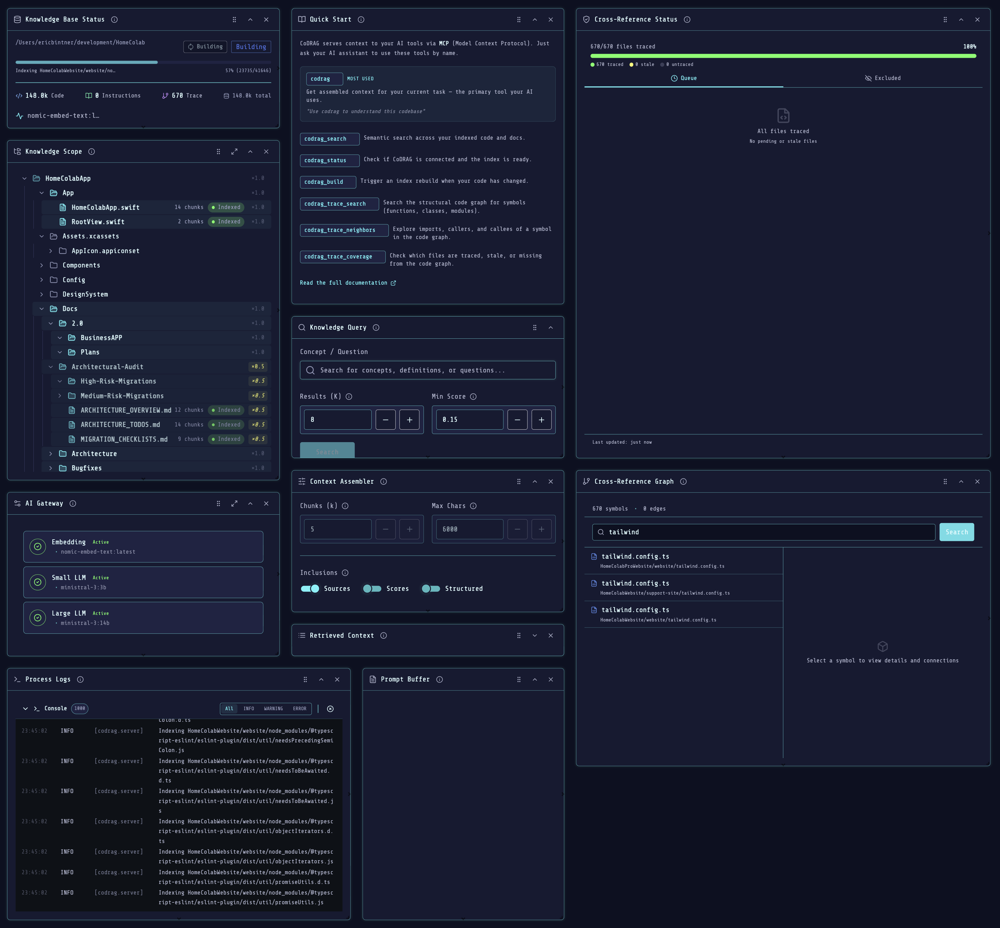

<h1 align="center">CoDRAG</h1>
<h2 align="center"><em>The bridge between how you think about code and how AI reads it.</em></h2>

**Code Documentation and RAG** — Local-first codebase intelligence for developers and AI coding agents.

AI assistants are only as good as the context they receive. Most tools send fragments — a single file, a keyword match — and the model fills in the gaps with hallucinations. CoDRAG fixes this by building a **persistent, semantic index** of your entire codebase (or multiple repos) and serving bounded, source-cited context on demand.

### Core capabilities

- **Semantic search** — find code by intent, not just keywords. Results are ranked by relevance across every file in the project.
- **Trace Index** — a structural code graph (symbols, imports, call chains) so agents can reason about *how* code connects, not just *where* it lives.
- **Context assembly** — returns bounded, LLM-ready chunks with source attribution. No more "which file was that from?"
- **MCP for IDEs** — plug into Cursor, Windsurf, Claude Desktop, VS Code, or JetBrains via Model Context Protocol. The agent gets the same index you do.
- **Local-first** — your code never leaves your machine. Indexes are built and queried locally; nothing is uploaded.

---

## CLI + MCP Quickstart

CoDRAG is primarily used in two ways:

- **CLI**: manage projects, build indexes, search, and assemble context.
- **MCP tool/server**: expose CoDRAG capabilities to IDEs (Windsurf, Cursor, Claude Desktop) via the Model Context Protocol.

### CLI (daemon mode)

```bash
# 1) Start the daemon
codrag serve

# 2) Register a repo
codrag add /path/to/your/repo

# 3) Build the index (async)
codrag build

# 4) Semantic search
codrag search "authentication middleware"

# 5) Assemble LLM-ready context
codrag context "explain the login flow" --raw
```

### MCP (IDE integration)

```bash
# Start MCP in server mode (connects to the running daemon)
codrag mcp --auto

# Generate IDE config (prints JSON)
codrag mcp-config --ide cursor
```

For the full CLI reference, see `docs/CLI.md`.

### GUI (Dashboard)

CoDRAG also ships with a **GUI dashboard** for day-to-day workflows:

- **Project visibility** (index status, staleness, trace status)
- **Build controls** and configuration editing
- **Search + preview** and **context assembly** (LLM-ready output)
- A modular layout you can tailor to your workflow



```bash
# Open the dashboard in your browser
codrag ui
```

## Vision

CoDRAG is a **local-first, team-ready** application that provides:

- **Semantic code search** across multiple codebases simultaneously
- **Trace indexing** for structural understanding (symbols, imports, call graphs)
- **LLM augmentation** for intelligent summaries and context assembly
- **Unified dashboard** with project tabs, search, and visualization
- **MCP integration** for IDE tools (Windsurf, Cursor, VS Code)

### Why CoDRAG?

| Developer Problem | CoDRAG Solution |
|---------|-----------------|
| "Managing separate RAG indexes for 5+ repos is tedious" | Single daemon manages all projects |
| "Each IDE tool spins up its own Ollama connection" | Shared LLM connection pool |
| "Juggling multiple ports/processes per project" | One port (8400), project tabs in UI |
| "Finding relevant code takes 20+ minutes for new devs" | Pre-indexed codebase with instant semantic search |
| "AI assistants forget codebase context between sessions" | Persistent trace index + structural memory |

---

## Architecture Overview

```
┌─────────────────────────────────────────────────────────────────────────┐
│                              CoDRAG                                     │
├─────────────────────────────────────────────────────────────────────────┤
│  Dashboard (React/Vite → Tauri for MVP)                                 │
│  ├── Project Tabs (LinuxBrain, HalleyApp, Website, ...)                 │
│  ├── Search / Context / Trace views                                     │
│  └── Settings / LLM Status                                              │
├─────────────────────────────────────────────────────────────────────────┤   
│  HTTP API (FastAPI @ :8400)                                             │
│  ├── /projects/*           Project management                           │
│  ├── /projects/{id}/build  Index building                               │
│  ├── /projects/{id}/search Semantic search                              │
│  ├── /projects/{id}/trace  Structural queries                           │
│  └── /llm/*                LLM service status                           │
├─────────────────────────────────────────────────────────────────────────┤
│  Core Engine                                                            │
│  ├── ProjectRegistry       SQLite-backed project config                 │
│  ├── EmbeddingIndex        Semantic vector search (per project)         │
│  ├── TraceIndex            Symbol graph + import edges                  │
│  ├── FileWatcher           Auto-rebuild on changes                      │
│  └── LLMCoordinator        Ollama/CLaRa connection management           │
├─────────────────────────────────────────────────────────────────────────┤
│  CLI                                                                    │
│  codrag serve | add | build | search | ui | mcp                         │
└─────────────────────────────────────────────────────────────────────────┘
            │                    │                    │
            ▼                    ▼                    ▼
       ┌─────────┐         ┌─────────┐           ┌─────────┐
       │ Ollama  │         │  CLaRa  │           │ Project │
       │ :11434  │         │  :8765  │           │  Dirs   │
       └─────────┘         └─────────┘           └─────────┘
```

---

## Key Features

### Multi-Project Management
- Add multiple local codebases to single daemon
- Each project maintains isolated index data
- Switch between projects via tabs or CLI
- Cross-project search (enterprise tier only)

### Hybrid Index Mode
- **Standalone mode** (default): Index stored in `~/.local/share/codrag/projects/`
- **Embedded mode** (team): Index stored in project `.codrag/` directory
- Teams can commit embedded indexes to git to skip initial indexing time

### Trace Index
Beyond keyword/semantic search, CoDRAG builds a **structural graph**:
- **Nodes:** Files, symbols, classes, functions, endpoints
- **Edges:** Imports, calls, inheritance relationships
- Queries: Find all callers of a function, trace import chains, explore class hierarchies

### LLM Integration
- **Embeddings:** Ollama (`nomic-embed-text` recommended) for semantic search
- **Compression:** CLaRa (optional) for context window optimization
- **Augmentation:** Mistral/Llama (optional) for code summaries
- Reuses single Ollama connection across all indexed projects

### AGENTS.md Generation
Generate [AGENTS.md](https://agents.md/) documentation from trace index:
- Project structure with file counts and organization
- Detected entry points and key modules
- Discovered build/test commands from common files
- API endpoints extracted from route definitions

---

## Installation

### Prerequisites
- macOS 11+ or Windows 10+
- 4GB free disk space
- Ollama (optional, for embeddings)

### Quick Start

```bash
# Download and install from codrag.io
# Or install via package manager:

# macOS (Homebrew)
brew install --cask codrag

# Windows (winget)
winget install MagneticAnomaly.CoDRAG

# Start the daemon
codrag serve

# Add a project
codrag add /path/to/your/project --name "MyProject"

# Open dashboard
codrag ui
```

### With Ollama

```bash
# Install Ollama (if not installed)
curl -fsSL https://ollama.com/install.sh | sh

# Pull embedding model
ollama pull nomic-embed-text

# CoDRAG will auto-detect Ollama at localhost:11434
```

---

## CLI Reference

The CLI is implemented with Typer; run `codrag --help` or `codrag <command> --help` for detailed help.

Full reference: `docs/CLI.md`.

### Common examples

```bash
# Start the daemon
codrag serve

# Add a repo
codrag add /path/to/your/repo

# Build the index (async)
codrag build

# Search your codebase
codrag search "authentication middleware"

# Assemble context for an LLM
codrag context "explain the login flow" --raw

# IDE integration (MCP)
codrag mcp --auto
```

### Full options (reference)

```bash
# Tip: most daemon-backed commands accept --host/--port (default: 127.0.0.1:8400)

# Daemon
codrag serve [--host 127.0.0.1] [--port 8400] [--reload]              # Start the daemon

# Projects
codrag add <path> [--name "Name"] [--mode standalone|embedded] \
  [--host 127.0.0.1] [--port 8400]                                     # Register project
codrag list [--host 127.0.0.1] [--port 8400]                            # List projects
codrag remove <project-id> [--purge] [--host 127.0.0.1] [--port 8400]   # Unregister project

# Index lifecycle
codrag status [project-id] [--host 127.0.0.1] [--port 8400]             # Index status
codrag build [project-id] [--full] [--host 127.0.0.1] [--port 8400]     # Trigger build (async)

# Retrieval
codrag search "query" [--project <project-id>] [--limit 10] [--min-score 0.15] \
  [--host 127.0.0.1] [--port 8400]                                      # Semantic search
codrag context "query" [--project <project-id>] [--limit 5] [--max-chars 8000] [--raw] \
  [--host 127.0.0.1] [--port 8400]                                      # Assemble context

# UI
codrag ui [--port 8400]                                                 # Open dashboard

# MCP (IDE integration)
codrag mcp [--mode server|direct] [--daemon http://127.0.0.1:8400] \
  [--auto] [--project <project-id>] [--repo-root <path>]                # Run MCP server (stdio)
codrag mcp-config [--ide claude|cursor|windsurf|vscode|jetbrains|all] \
  [--mode auto|project|direct] [--daemon http://127.0.0.1:8400] [--project <project-id>]  # Print IDE config JSON

# Extras
codrag activity [--weeks 12] [--no-legend] [--no-labels] [--json] \
  [--host 127.0.0.1] [--port 8400]                                      # Activity heatmap
codrag coverage [--project <id>] [--host 127.0.0.1] [--port 8400]       # Coverage visualization
codrag overview [--weeks 12] [--host 127.0.0.1] [--port 8400]            # Terminal overview dashboard
codrag drift [--project <id>] [--host 127.0.0.1] [--port 8400]          # Index drift report
codrag flow [--project <id>] [--host 127.0.0.1] [--port 8400]           # RAG flow visualization
codrag config [key] [value] [--host 127.0.0.1] [--port 8400]            # View/modify config
codrag version                                                          # Version
```

---

## Configuration

### Global Config

```yaml
# ~/.config/codrag/config.yaml

# LLM Services
ollama:
  url: http://localhost:11434
  embedding_model: nomic-embed-text
  augmentation_model: mistral  # optional
  
clara:
  url: http://localhost:8765
  enabled: false  # optional compression

# Index Settings
index:
  data_dir: ~/.local/share/codrag
  max_size_gb: 10

# Auto-Rebuild
watch:
  enabled: true
  debounce_ms: 5000

# Server
server:
  port: 8400
  host: 0.0.0.0  # for team access
```

### Per-Project Config

```yaml
# Set via CLI or dashboard
project:
  name: "LinuxBrain"
  path: LinuxBrain
  mode: standalone  # or "embedded"
  
  include:
    - "**/*.py"
    - "**/*.md"
    - "**/*.ts"
    - "**/*.tsx"
    
  exclude:
    - "**/node_modules/**"
    - "**/.venv/**"
    - "**/dist/**"
    - "**/__pycache__/**"
    
  trace:
    enabled: true
    languages: [python, typescript]
    
  auto_rebuild: true
```

### Environment Variables

| Variable | Default | Description |
|----------|---------|-------------|
| `CODRAG_ENGINE` | `auto` | Selects the indexing engine: `auto` (detect best available), `rust` (faster, requires Rust build), `python` (pure Python fallback) |
| `CODRAG_TIER` | (from license) | Override license tier for development/testing: `free`, `starter`, `pro`, `team`, `enterprise` |
| `OLLAMA_HOST` | `http://localhost:11434` | Ollama server URL (standard Ollama env var) |

**Example:**
```bash
# Use Python engine for debugging
CODRAG_ENGINE=python codrag serve

# Test Pro features locally
CODRAG_TIER=pro codrag serve
```

---

## API Reference

### Projects

```
GET  /projects                    List all projects
POST /projects                    Add new project
GET  /projects/{id}               Get project details
PUT  /projects/{id}               Update project config
DELETE /projects/{id}             Remove project
```

### Indexing

```
GET  /projects/{id}/status        Index status
POST /projects/{id}/build         Trigger build
GET  /projects/{id}/build/status  Build progress
```

### Search & Context

```
POST /projects/{id}/search        Semantic search
POST /projects/{id}/context       Assemble context for LLM
```

### Trace

```
GET  /projects/{id}/trace/status  Trace index status
POST /projects/{id}/trace/search  Symbol search
POST /projects/{id}/trace/node    Get node details
POST /projects/{id}/trace/neighbors  Graph expansion
```

### LLM

```
GET  /llm/status                  Ollama/CLaRa connection status
POST /llm/test                    Test connections
```

---

## Team / Enterprise Features

### Embedded Mode for Teams

```bash
# Team lead sets up project with embedded index
codrag add /path/to/team-project --embedded

# Index lives in /path/to/team-project/.codrag/
# Commit to git:
git add .codrag/
git commit -m "Add CoDRAG index"

# Team members clone and use existing index
git clone <repo>
codrag add /path/to/repo --embedded  # Uses committed index, skips rebuild
# Note: Index may need refresh if codebase has changed since commit
```

### Network Mode (Enterprise)

```bash
# Run CoDRAG server on team machine
codrag serve --host 0.0.0.0 --port 8400

# Team members connect remotely (read-only access to indexes)
codrag config set server.remote_url http://team-server:8400

# Search/context requests use shared server's indexes
# Note: Each client still needs local CoDRAG installation
```

### Access Control (Roadmap)

- Project-level permissions
- API key authentication
- Audit logging

---

## Development

### Project Structure

```
CoDRAG/
├── src/
│   └── codrag/
│       ├── __init__.py
│       ├── cli.py              # CLI entry point
│       ├── server.py           # FastAPI app
│       ├── core/
│       │   ├── registry.py     # Project registry (SQLite)
│       │   ├── embedding.py    # Embedding index
│       │   ├── trace.py        # Trace index
│       │   ├── watcher.py      # File watcher
│       │   └── llm.py          # LLM coordinator
│       └── api/
│           ├── projects.py     # /projects routes
│           ├── search.py       # /search routes
│           ├── trace.py        # /trace routes
│           └── llm.py          # /llm routes
├── dashboard/
│   ├── src/
│   │   ├── App.tsx
│   │   ├── components/
│   │   └── pages/
│   ├── package.json
│   └── vite.config.ts
├── docs/
│   ├── ARCHITECTURE.md
│   ├── ROADMAP.md
│   └── API.md
├── tests/
├── pyproject.toml
└── README.md
```

### Running in Development

```bash
# Terminal 1: Backend
source .venv/bin/activate
uvicorn codrag.server:app --reload --port 8400

# Terminal 2: Dashboard
cd dashboard
npm run dev

# Open http://localhost:5173 (Vite dev server proxies to :8400)
```

### Testing

```bash
pytest tests/
npm run test --prefix dashboard
```

---

## Roadmap

See [PHASES.md](docs/PHASES.md) for the authoritative phase index and [ROADMAP.md](docs/ROADMAP.md) for detailed phase writeups.

| Phase | Focus | Timeline |
|-------|-------|----------|
| **01: Foundation** | Core engine, CLI, basic API | |
| **02: Dashboard** | UI, project management, search/context views | |
| **03: Auto-Rebuild** | File watching, incremental builds | |
| **04: Trace Index** | Symbol extraction, graph queries | |
| **05: MCP Integration** | IDE tool support | |
| **06: Team & Enterprise** | Embedded mode + enterprise guardrails | |
| **07: Polish & Testing** | Reliability, UX, regression coverage | |
| **08: Tauri MVP** | Native app wrapper (MVP milestone) | |
| **09: Post-MVP** | Structured expansion proposals | |
| **10: Business & Competitive Research** | Pricing, positioning, licensing | |
| **11: Deployment** | Packaging, distribution, updates | |
| **12: Marketing / Docs / Website** | Documentation + public-facing assets | |
| **13: Storybook** | Design system + UI component library | |

---

## Related Projects

- **[Ollama](https://ollama.com/)** — Local LLM serving (CoDRAG uses for embeddings)
- **[CLaRa](https://github.com/apple/ml-clara)** — Context compression (optional integration)
---

