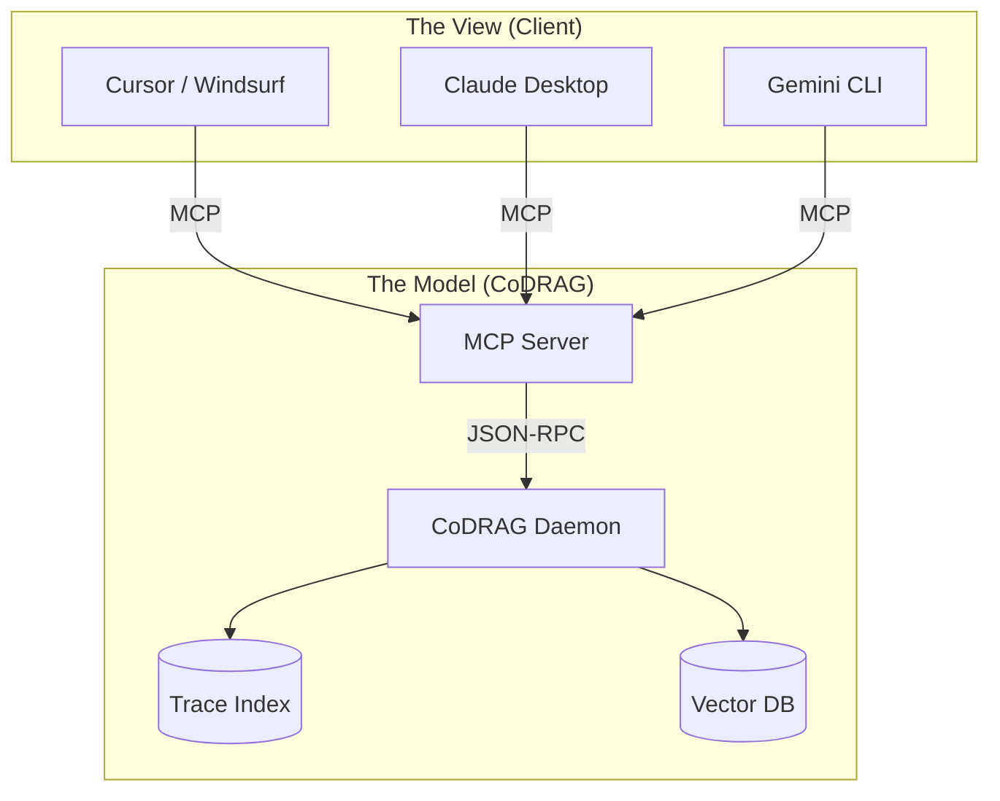

# CoDRAG MCP

<div align="center">

**The Universal Context Model for AI Coding Agents**

[](LICENSE)
[](https://modelcontextprotocol.io)
[](https://codrag.io)

</div>

**CoDRAG** is a local-first **Model Context Protocol (MCP)** server that turns your codebase into a queryable knowledge graph for AI tools.

> **"The bridge between how you think about code and how AI reads it."**

Most AI coding assistants (Cursor, Windsurf, Claude) are brilliant reasoning engines, but they suffer from **context myopia**. They only see the files you open or the snippets you paste. They miss the broader architecture—the class hierarchies, the import chains, the "how it all connects."

CoDRAG fixes this. It indexes your entire repository locally, builds a **structural trace graph**, and serves that deep context to your AI tool via MCP.

---


## Why CoDRAG?

AI tools are evolving fast. The context they need shouldn't be locked inside one specific editor.

| Developer Problem | CoDRAG Solution |
|:---|:---|
| **"AI hallucinations"** | AI guesses when it lacks context. CoDRAG provides **grounded, source-cited context** from the whole repo. |
| **"Fragmented Context"** | Each tool (Cursor, VS Code, CLI) has its own partial index. CoDRAG is a **unified context server** for *all* your tools. |
| **"Dumb Search"** | grep/regex misses concepts. CoDRAG uses **Trace Indexing** (Who calls this? What implements this interface?) + Semantic Search. |
| **"Privacy Risks"** | Most tools upload code to index it. CoDRAG is **100% Local-First**. Your code never leaves your machine. |
| **"Context Window Limits"** | Pasting huge files wastes tokens. CoDRAG uses **Context Compression** (via [CLaRa](https://github.com/apple/ml-clara)) to pack 80% more meaning into the same window. |

## The "Context MVC" Architecture

We believe in a **Model-View-Controller** approach to AI development:

- **The Model (CoDRAG)**: The source of truth. Manages the trace graph, file index, semantic search, and context assembly.
- **The View (Your Tool)**: Cursor, Windsurf, Claude Desktop, Gemini CLI, or VS Code. Handles the UI and LLM inference.

CoDRAG is the universal model. Bring your own view.

## Key Features

### 🗂️ Multi-Project Management
- **Centralized Daemon**: Add multiple local codebases to a single background service.
- **Isolated Indexes**: Each project maintains its own isolated index data.
- **Instant Switching**: Switch active context between projects instantly via the Dashboard or CLI.

### 🕸️ Trace Index
Beyond simple vector search, CoDRAG builds a **structural graph** of your code:
- **Nodes**: Files, symbols, classes, functions, endpoints.
- **Edges**: Imports, calls, inheritance relationships.
- **Queries**: Find all callers of a function, trace import chains, explore class hierarchies.

### ⚡ Hybrid Index Mode
- **Standalone Mode** (Default): Index is stored in your user data directory (`~/.local/share/codrag`).
- **Embedded Mode** (Teams): Index is stored in the project's `.codrag/` directory. Teams can commit these indexes to git, allowing new members to skip the initial indexing time.

### 🤖 LLM Integration
- **Embeddings**: Uses local Ollama models (`nomic-embed-text` recommended) or native ONNX for zero-latency semantic search.
- **Compression**: Optional integration with **CLaRa** for intelligent context window optimization.
- **Resource Efficient**: Reuses a single model connection across all your indexed projects.

### 📄 AGENTS.md Generation
Automatically generate [AGENTS.md](https://agents.md/) documentation from the trace index to help other AI agents understand your project structure, entry points, and API endpoints.

---

## ⚠️ Prerequisites: The CoDRAG Engine

**This repository contains the MCP interface definitions.** To use it, you must install the **CoDRAG Desktop App**, which acts as the engine. It manages the background daemon, the local vector database, and the trace graph builder.

### 1. Install CoDRAG

**macOS (Homebrew)**
```bash
brew install --cask codrag
```

**Windows (winget)**
```bash
winget install MagneticAnomaly.CoDRAG
```

*The core engine is free for personal use (1 active project). See [Pricing](https://codrag.io/pricing) for Pro/Team tiers.*

### 2. Connect Your Tool

Once the app is running, it exposes the MCP endpoint that any compatible tool can connect to.

## Verified Integrations

CoDRAG works out-of-the-box with any MCP-compatible client. We officially verify and document the following "Views":

### 🟢 Tier 1: Verified Views
- **[Cursor](https://cursor.sh)** — The AI code editor.
- **[Windsurf](https://windsurf.ai)** — The agentic IDE.
- **[Claude Desktop](https://claude.ai/download)** — Anthropic's official desktop app.
- **[VS Code](https://code.visualstudio.com)** — Via the official CoDRAG extension.
- **[Gemini CLI Desktop](https://github.com/Piebald-AI/gemini-cli-desktop)** — The open-source "Claude Desktop" alternative.
- **[Qwen Code](https://github.com/QwenLM/qwen-agent)** — The terminal agent for Qwen models.

### 🟡 Tier 2: Community Views
- **JetBrains** — Supported via generic MCP plugins.
- **Zed** — Experimental support.

## Usage Guide

You can run CoDRAG in two modes depending on your workflow:

### 1. Daemon Mode (Recommended)
The CoDRAG Desktop App runs a background daemon (`codrag serve`) that manages indexes for multiple projects efficiently. The MCP server connects to this daemon. This allows you to switch projects in the GUI and have your AI tool instantly context-switch.

```bash
# Start the daemon via the App or Terminal
codrag serve

# In your MCP config, use this command:
codrag mcp --auto
```

### 2. Direct Mode
Runs the MCP server directly in your terminal. Best for single-repo usage without the full daemon.

```bash
codrag mcp --mode direct
```

### Automatic Configuration
Generate the config for your favorite tool:

```bash
# Print config for Cursor
codrag mcp-config --ide cursor

# Print config for Claude Desktop
codrag mcp-config --ide claude

# Print config for Gemini CLI / Windsurf / VS Code
codrag mcp-config --ide all
```

## System Architecture



## License

The CoDRAG Desktop App and Engine are commercial software.
This repository serves as the public documentation and issue tracker for the MCP integration.

See [LICENSE](LICENSE) for details on this repository's content.
See [codrag.io/terms](https://codrag.io/terms) for the CoDRAG application license.
